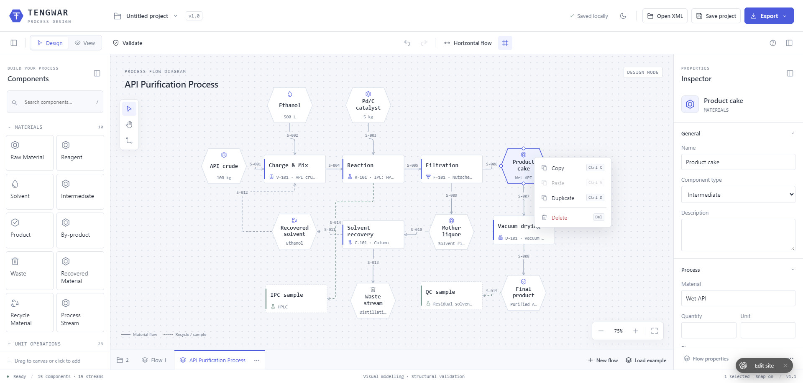
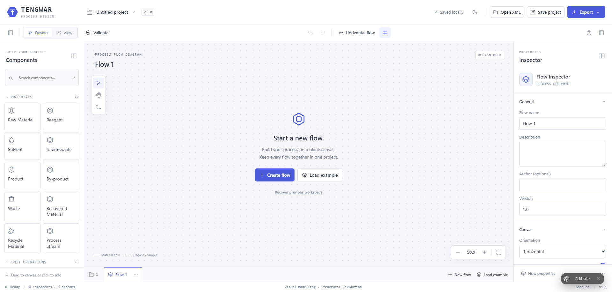
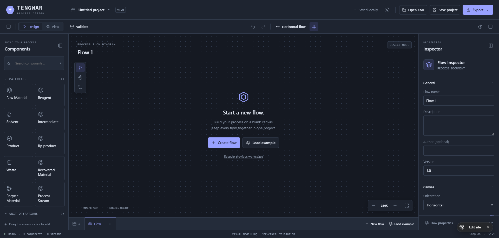
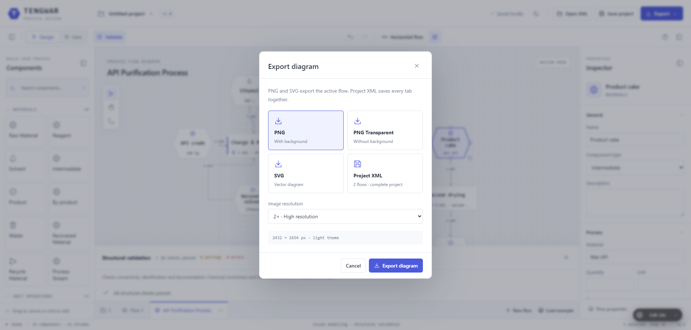

# TENGWAR

### Process Design

**Make the process visible.**

A visual workspace for modelling materials, unit operations and process streams. 
An experimental project exploring process design for chemistry and pharmaceutical workflows.

[Explore the workspace](#the-workspace) · [Get started](#get-started) · [Project status](#project-status)

 

An illustrative API purification flow, with materials, operations, recovery loops and sampling steps in one workspace.

> [!IMPORTANT]
> **Experimental · Work in progress.** Tengwar is an evolving prototype for visual modelling and exploration. Features, behaviour and file formats may change. It is not a validated engineering or laboratory system, and its diagrams and checks must not be treated as scientific, safety or regulatory approval.

## Why Tengwar

A process is more than a sequence of boxes. Materials enter, operations transform them, intermediate products move between stages, and recovery loops and sampling points connect different parts of the flow.

Tengwar explores a visual language that makes those relationships easier to map, discuss and refine. It brings domain-oriented components, editable properties and multiple flows into one project, so the diagram can carry more of the process context.

The aim is a focused workspace for turning an initial process idea into a readable, structured model.

## The workspace

| Capability | What it brings to the model |
| --- | --- |
| **Domain-oriented components** | Materials such as reagents, solvents, intermediates, products and waste, alongside unit operations. |
| **Connected process streams** | Visual relationships between materials and operations, including recycle and sample connections. |
| **Component inspector** | Editable names, types, descriptions and relevant process fields, including material, quantity and unit. |
| **Multiple flows per project** | Related diagrams organised as tabs and saved together in a project XML file. |
| **Canvas controls** | Zoom, grid, orientation controls and separate Design and View modes. |
| **Structural validation** | Diagram checks to support model review; these do not establish physical or chemical correctness. |
| **Portable exports** | PNG, transparent PNG and SVG for the active flow; XML for the complete project. |
| **Light and dark themes** | Two visual treatments for the same modelling workspace. |

### Start with a blank canvas. Or an example.

Create a new flow to build your own model, or load an example to explore the workspace. Keep related flows together as the project develops.

<strong>See the dark workspace</strong>

 

### Keep the model. Share the diagram.

Export the active flow as an image or vector graphic for discussion and documentation. Save the complete project as XML to keep its flows together and reopen them later.

| Format | Scope | Intended use |
| --- | --- | --- |
| **PNG** | Active flow | Presentations and documentation |
| **Transparent PNG** | Active flow | Placement on a custom background |
| **SVG** | Active flow | Scalable diagram graphics |
| **Project XML** | All project flows | Saving and reopening the editable project |

## Get started

From the Tengwar workspace:

1. Select **Load example** to explore an existing flow, or **Create flow** to start fresh.
2. Add components from the palette and connect the process streams.
3. Select a component to edit its properties in the **Inspector**.
4. Use **New flow** to add another diagram to the project.
5. Run **Validate** to review the diagram's structural checks.
6. Use **Save project** or **Project XML** to keep an editable copy, and export the active diagram as PNG or SVG when needed.

Keep exported project backups while experimenting, particularly before moving between versions.

## Project status

**Tengwar is being developed in the open as an experimental process-design workspace.** The current focus is exploring the modelling experience and refining it through practical feedback.

The screenshots show the prototype interface. Available controls and behaviour may evolve as development continues; the project does not yet promise a stable feature set or file-format compatibility across versions.

### Scope and boundaries

Tengwar supports visual representation and structural review. It is not a process simulator, an execution engine or a validated laboratory information system. A structurally valid diagram does not establish a correct mass balance, feasible reaction, safe operating condition or compliant procedure.

Examples are illustrative models, not operating instructions.

### Feedback that helps

Feedback is especially useful when it describes a concrete modelling problem:

- A material, operation or relationship that is difficult to represent.
- A property that needs clearer meaning or better presentation.
- A diagram interaction that makes editing unnecessarily difficult.
- An import, export or structural-check issue that can be reproduced.

When reporting a problem, include the steps, expected behaviour and browser version. Use a minimal, non-confidential example project or screenshot where possible.

---

**Tengwar · Process Design** 
Created by [Antonio Lamanna](https://antoniolamanna.com)

Experimental software. An evolving exploration of visual process modelling.

